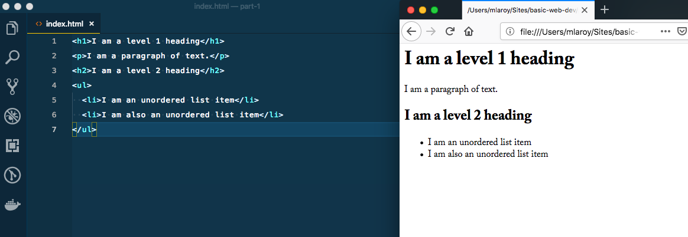

If you have ever wanted to learn how to build a website for the first time, this series is for you. My intention here is to introduce some of the basic topics of building a web page, including some of the languages, tools, techniques, and knowledge required to build your first site.

## What this is - and isn't

Initially, I considered giving some extra background information, such as the history of the internet, what HTTP is and how it works, etc. but the plan here is to get you started with just enough information to start building something simple. You can find a lot of background information in many places, like [wikipedia](https://en.wikipedia.org/wiki/Website) for example.

In short, this will be some practial steps to follow to get your first website up and running using basic, but modern approaches.

## Let's begin: What is a website?

At its core, a website in its simplest form is a _document_, like a book or a letter. It can contain text, pictures, and more, and has the ability to connect to other documents through _hypertext_ - or in everyday parlance, a link. This is the **HT** in HTML, and is what gives a website its power. The way we access our document is through a program called a browser. The browser is specially designed to understand our document, and handle the links to other websites.

On top of being a document, a website can also be enhanced to be interactive, and behave like an application - many services use this approach, such as your banking institution or online stores. The browser is the native environment where this interactivity can take place.

Utimately, our document needs to live on a computer that is accessible from the internet - we refer to this as a _server_. Essentially, your document exists on a server that is connected to the internet. Luckily, web browsers can also handle files that are just on your computer, and not yet on the internet - this is very handy when it comes to creating our website, before showing it to the world.  Keep in mind that your computer is not acting like a web server, we are merely accessing the computer's file system. More on this topic in a future post.

## Getting started

Like other files on our computer, we have to give our document a name and an extension - sound files can have a `.mp3` or `.wav` extensions, image files can have `.jpg` or `.png` extensions, MS Word files can have a `.doc` extension, etc. Our simplest website document should have a `.html` extension. A common practice when starting a new page is to call it `index.html` - browsers understand this special name to be the primary file to read if you have multiple files available -- more on that later.

Our website document should be created using plain text - a fancy word processor (like MS Word) is not an appropriate tool because what it ultimately creates is not plain text, but rich text with all kinds of formatting, etc. So, the first thing we will need is a text editor that works with plain, unformatted text.

Here are some examples of commonly used text editors for making HTML documents:
* [Sublime Text](https://www.sublimetext.com/3)
* [VS Code](https://code.visualstudio.com/download)
* [Notepad++](https://notepad-plus-plus.org/download/v7.6.3.html)

These text editors come with lots of tools designed to help you out, but at their core they all do the same thing: they let us create the documents in the proper formats required to make our website work.

If you don't already have a program like this, now is the time to download one. They are all free to use, so go ahead and choose one. I have used both Sublime and VS Code in my professinal career, but they are all excellent choices.

## Our first HTML file

Using our text editor of choice, let's create a new file, and call it `index.html`. Now inside this file, we'll add this text:

```html
Hello World!
```

Next, we can see this in a browser by dragging the file from a Finder window right into an open browser window (if you're on a Mac), or by right-clicking the file and select `Open With` and choose a browser, like Firefox or Chrome.


Then, we should see `Hello World!` in our browser window!


And there we have it - a website in its most basic form: just text content. Next, we will add a little more to our index file, so that the browser can do a little bit more work for us.

## Writing markup

In every HTML file, we can add special text called _markup_ - this is the **M** in HTML - that communicates extra information to the browser.  We can tell the browser some special details about our document using particular markup for specific things we want to communicate, in the form of _tags_. These markup tags ultimately create what we call [HTML elements](https://developer.mozilla.org/en-US/docs/Web/HTML/Element).

Tags work by declaring the start and end of our special piece of information. For example, if we want to say that our text is a _paragraph_ of text, we can use the `p` tag. We begin our text with an _opening_ tag: `<p>`, and finish it with a _closing_ tag `</p>`. We call markup such as this _semantic_, because it conveys special meaning about its contents.

```html
<p>I am a paragraph of text.</p>
```

By default, browsers have special formatting for such semantic markup. Let's see what that means by adding a few more things to our basic `index.html` file:

```html
<h1>I am a level 1 heading</h1>
<p>I am a paragraph of text.</p>
<ul>
  <li>I am an unordered list item</li>
  <li>I am also an unordered list item</li>
</ul>
```

Here, we add a few new tags. We are adding our original `p` tag, as well as the `h1` and `h2` heading tags, as well as `ul` and `li` tags, which indicate an unordered list. Let's refresh the page to see what happens:



As we can see, our headings (`h1` and `h2` tags) are rendered with larger and bolder styles. You can see the `h1` is larger than the `h2`, since it's a more prominent heading level. These levels help to give our document a hierarchy of information. It's also worth noting here that our document should only ever have one `h1` tag, but we can have as many of the other levels (up to `h6`) as we like.

Further, we have an unordered list, which produces some bullets and indentation for our list items. We can also create an ordered list, by changing the outer tags from `ul` to `ol`. This will have the effect of producing numbers for each list item.

Not only do browsers give styles to our semantic markup, but assistive technologies (used by persons with no or diminished eyesight, for example) are able to interpret these semantics and communicate it to the person accessing the website via these technologies. As such, it is very important to get our semantics right, and use the appropriate tags for the kind of content we are creating.

## Making a document

Finally, we can add markup to our document that communicates information about the document itself. Not all of this will be visible in the browser as we have seen, but it can communicate information to be read by search engines, and provide a mechanism for us to enhance the basic website we have seen up to this point.

```html
<!DOCTYPE html>
<html lang="en">
  <head>
    <meta charset="UTF-8">
    <meta name="viewport" content="width=device-width, initial-scale=1.0">
    <title>Basic Web Development</title>
  </head>
  <body>
    <p>Only I am visible in the browser</p>
  </body>
</html>
```


Our document now has some extras. First of all, notice the `<!DOCTYPE html>` - here we are telling the browser what kind of document this is, so that it knows what specifications to use when presenting our document. The specs have changed over the years, and the latest and greatest is called _HTML5_.

Next, we have the `html` tag itself. Since we have declared the type, now we must use this which is meant to be the _root elemnt_, or the parent of all the other tags we will use, which would be referred to as children.

Next is the `head` tag. Here is where we can put our extra information about the content of document. The first ones here are the `meta` tags,   telling the browser which [character encoding](https://developer.mozilla.org/en-US/docs/Glossary/UTF-8) to use (there are many), as well as how to render pixels for devices with higher densities of pixels, such as an iPhone with a retina screen. This ultimately helps us with making responsive websites, where the content and styles can be automatically adjusted to fit the screen that is viewing it. There are many other [meta tags](https://developer.mozilla.org/en-US/docs/Web/HTML/Element/meta) which can communicate all sorts of things for us.

The last part here is the `title` tag. Notice in our browser, the tab at the top has changed from showing the file path of our `index.html` file to showing the contents of this tag, which says `Basic Web Development`.  Not only does it make our browser tab nicer, this is also a semantic feature that tells us what our document is called, is seen by assistive technologies, as well as being used by search engines, which will display it in a search result.

Finally, the `body` tag is where we place any actual content of our document. All of our headings, paragraphs, and lists (like we first saw above) and more should go inside the body tag.

## Wrapping it up

Finally, with our document type declared, and content added inside our `body` tag, we have the foundation of our basic HTML webpage. Let's finish off our `index.html` file with a few more HTML elements that you can go and read about elsewhere:

```html
<!DOCTYPE html>
<html lang="en">
  <head>
    <meta charset="UTF-8">
    <meta name="viewport" content="width=device-width, initial-scale=1.0">
    <title>Basic Web Development</title>
  </head>
  <body>
    <h1>Basic Web Development</h1>
    <p>How about a horizontal rule? Here's one:</p>
    <hr>
    <p>Adding markup is easy! Here's a list of fruit:</p>
    <ul>
      <li>Apple 🍏</li>
      <li>Orange 🍊</li>
      <li>Banana 🍌</li>
    </ul>
    <hr>
    <p>Now let's try it in a table:</p>
    <table>
      <thead>
        <tr>
          <th>Fruit</th>
          <th>Emoji</th>
        </tr>
      </thead>
      <tbody>
        <tr>
          <td>Apple</td>
          <td>🍏</td>
        </tr>
        <tr>
          <td>Orange</td>
          <td>🍊</td>
        </tr>
        <tr>
          <td>Banana</td>
          <td>🍌</td>
        </tr>
      </tbody>
    </table>
  </body>
</html>
```


There are dozens of HTML elements available, and each has its own specific purpose and uses. Although we have only touched on a few of them here, we have already built a foundation for building a solid website.

So far we have:
* downloaded a text editor
* learned about `.html` files
* used tags to mark up our html file with paragraphs, lists, headings, and tables
* added a title to the `head` of our document
* viewed our HTML page in a browser

**Next time: Part 2 - Markup cont'd, and Adding Styles**