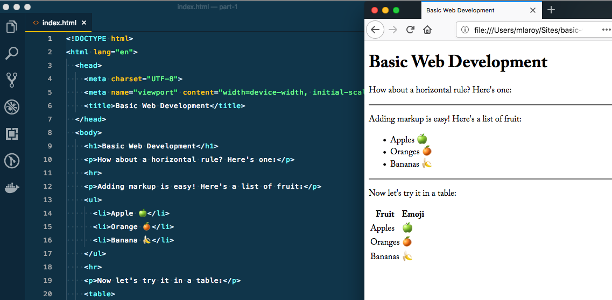

In our [last post](/blog/basic-web-development-part-1), we introduced the concept of a website in its most simple form. We got ourselves a text editor designed for writing code. Then we started writing some basic tags, and even created an HTML document. Finally, we saw opened our HTML document in the browser, like a real web page! Here's where we left off:



*But it still doesn't look like much...*

How do we solve that? How can we make our site look better? Clearly there's more to it than just tags to give this some *style*.  There are a couple of tags we can place in our HTML documents to help us out in this regard, and we'll start with the easier one.

## Adding styles with the Style tag

The `<style>` tag works just like the other tags we learned about before, with an opening and closing tag. Usually we might place this inside our `<head>` tag, and put our content inside the tags:

```html
<head>
    <style>
      // style content goes here
    </style>
 </head>
```

Techically this can be placed anywhere in the document, but it is the convention to place any styles *before* content. The HTML document gets read from top to bottom, and if it knows about the styles before it sees the content, it will render it the way we want it to look.

However, we still have to know what goes in between our `<style>` tags. This introduces our next big topic, which is CSS - Cascading Style Sheets.

## CSS

CSS is a declarative language, such that we “declare” what our page should look like, one property at a time. We do this using *selectors* - we select an element or a group of elements, and then declare some styles that they should have:

```css
body {
    background-color: red;
 }
```

In the example above, we use `body` to select our `<body>` tag, and then we use some curly braces to contain our styles. There are more properties available than most of us would ever use, but we will stick to a few ofthe most [common ones](https://developer.mozilla.org/en-US/docs/Web/CSS/CSS_Properties_Reference) for now. Let's see how it looks, using the same `index.html` file we were using previously:


As you can see, even a single property can make a big impact, so let's ditch the red, and add a few other common properties to the `body` and give our document some more pleasing styles. It is a covention to have a single declaration per line:

```css
body {
    background-color: #fafafa;
    padding: 20px;
    margin: 0 auto;
    max-width: 800px;
    font-family: Helvetica, Arial, sans-serif;
    color: #222;
 }
```

Here we introduce a few more properties that deal with the [box-model](https://developer.mozilla.org/en-US/docs/Web/CSS/CSS_Box_Model/Introduction_to_the_CSS_box_model) but we'll get into that a bit later. For now, let's start with some of the basics.

### Padding

The `padding` property gives some breathing room around the element - think of giving it a thick winter jacket, with a layer of cushioning between the element and anything surrounding it. In this instance, the `padding` property is a shorter form that includes all 4 sides of the element: top, right, bottom, and left - in that order (think clockwise, starting at 12). We call this approach *shorthand*. If they are all the same, we can declare it once as we did above, using shorthand. Or, we could set these individually, like so,:

```css
/* shorthand, for when all values match */
 body {
    padding-top: 20px;
 }

 /* shorthand, setting top, right, bottom, left */
 body {
    padding-top: 20px 20px 20px 20px;
 }

 /* or separate lines for each property */
 body {
    padding-top: 20px;
    padding-right: 20px;
    padding-left: 20px;
    padding-bottom: 20px;
 }
```

### Margin

The `margin` property refers to the actual distance between an element and any adjacent element. It works the same way as padding, where we could set individial margins, or use the shorthand. In this instance, it's slightly different, since the values are different. Here, we set top/bottom left/right values. This would be akin to doing it like this:

```css
/* shorthand, for top/bottom left/right */
 body {
    margin: 0 auto;
 }

 body {
    margin-top: 0;
    margin-right: auto;
    margin-left: auto;
    margin-bottom: 0;
 }
```

The distinction between `padding` and `margin` is an important one - I highly recommend exporling the page at the link above in reference to the box model.

### Width and Max-width

The `max-width` property tells it not to exceed a certain size, though depending on what the element container, it could potentially be smaller, and that would be ok too. This is in contrast to the more simple `width` which is a more explicit property, regarless of the contents.

### Fonts

Finally, the `font-family` property let's us set the font we want to use. You'll notice that we have muliple ones here, separated by a comma. The browser will go left to right, and will only use the subsequent font if it can't find the first one. In this case, `Helvetica` is a system font on any Mac, but a Windows computer doesn't have it by default. So a Mac will render the page using Helvetica, and a Windows machine Arial. Finally, we use a more generic `sans-serif` in case both of the first ones fail. We'll look at using different font approaches and examining font services in a future post.

```css
body {
    font-family: Helvetica, Arial, sans-serif;
 }
```

### Colours

Finally, you'll see that our `color` and `background-color` properties are using weird numbers. This is using the [hexadecimal](https://en.wikipedia.org/wiki/Hexadecimal) system to reference colour values. In CSS, it uses six digits; two each for the red, green and blue components of the colour. A three digit value is also valid, depending on the configuration. Follow the link above for a more information. Here's a handy tool to help [find the codes for the colours](https://htmlcolorcodes.com/) you're looking to use.

Our newly styled page should look like this:


A large website with many pages and even more elements could have *a lot* of styles. As you can imagine, it could get unweildy and tough to manage, so it is common practice to include our style another way.

## Adding styles with the link tag

Just like our `style`, `meta`, and `title` tags, this one belongs in the `head` as well. But first, let's create a new file to put our CSS in. Right next to our `index.html` file in the same directory, let's call it `styles.css`. Then, we'll connect it with a link tag:

```html
<!DOCTYPE html>
<html lang="en">
  <head>
    <meta charset="UTF-8">
    <meta name="viewport" content="width=device-width, initial-scale=1.0">
    <title>Basic Web Development</title>
    <link href="styles.css" rel="stylesheet">
```


As you can see, the effect is the same, but our `head` area is much tidier, and we can use a dedicated file for our styles. One thing to note is that the browser has to make an additional request to the server for external files referenced in `index.html` such as this. This is hardly a drawback - indeed the benefits outweight the potential drawbacks as retrieving a single stylesheet is a fairly trivial exercise for the server.

## Separation of concerns

One such benefit is the [separation of concerns](https://www.quora.com/What-is-separation-of-concerns-in-software-development), which is a benefit to the developer (you, in this case). In short, it is a benefit because it helps to keep things organized, particularly as our code base can grow, containing dozens, hundreds, or even thousands of files! This way, we know what a given file is supposed to be “concerned” with, and as such should only do a single particular thing.

There are many different philosophies about which concerns ought to be separated and in which ways. For the purposes of this lesson, our `HTML` files will be concerned with the content, and our `CSS` files concerned with the style.

So far we have:
* added a `style` tag
* added a few styles to the `body` tag
* created a separate CSS file
* linked to our separate file using the `link` tag

### Having troubles?
* Is your CSS file in the same directory/folder as your `index.html` file?
* Is your `link` pointing to the right file? If it is in a different directory, make sure the `href` attribute is pointing to it. E.g. `href="/css/style.css"` if you placed it in a folder.
* Is your syntax correct?  Make sure you are placing styles between the curly braces `{}`, and ending each declaration with a semi-colon `;`.

Next time, we'll go a little more in depth with our styles, and make a more interesting and creative layout.