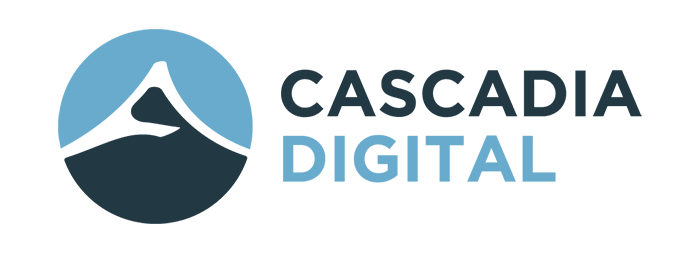

    

Starting a business is something that's been on my mind for quite some time now, stretching back to the early days of my career in web development. I actually did so a couple of years ago, out of practical need to be able to take on a full time job as a contractor for a large national corporation. Beginning as just a numbered company, the original seed of my desire to work for myself got a little water and sunshine, so I decided to name the business and started to think about it as a vehicle for actually making that desire to be my own boss a reality.

And so, [Cascadia Digital](https://cascadia.digital) was born. I designed a logo, picked some colours, and put up a website to mark my territory on the web. What I would actually _do_ with my business was yet to be determined. Indeed, that still remains the case. But today marks the first day that I will be dedicating time specifically to figuring that out, and taking steps to make my business something more than a means to be able to do contract work.

## What is Cascadia Digital?

I know that what Cascadia Digital will become is going to evolve over time. For the time being, I do contract work as a somewhat generalist front-end web developer, which is a pretty great place to start. I have great connections and relationships, and I've worked with some great organizations filled with talented people, gained exposure to an array of approaches to projects, technologies, and philosophies in the digital space.

My aim now, as I continue to serve the clients that I have, is to narrow my focus more intentionally. A common apprehension in doing so stems from the fear that "niching down" will put a limit on the work I will be able to find. I don't think this is a fear that I have, but I have struggled to articulate what kind of problems I want to be solving, and for whom. As a generalist front-end developer, my skillset can be valuable to just about any kind of client. So why put a limit on who I might potentially serve with my this skillset?

In reality, there's nothing distinguishing about being a front-end developer. There are literally thousands (millions?) of us out there. What is it that makes me different, such that someone would want to hire me over one of the many options available to them?

What I have been learning, is that the answer lies in building trust, and in building authority. Alastair McDermott, on his podcast [Marketing for Consultants](https://marketingforconsultants.com/), makes clear that narrowing your focus, or targeting a specific kind of client or demographic for marketing purposes doesn't necessarily need to limit the actual work you end up doing. But what it does do, is gives you a way that you can stand out, and be known as an authority to be sought out for solving a specific kind of problem.

### What am I an authority on?

There are problably a number of answers to this question for me. I'm not new to the field of web development or to some of the technologies and methods used to deliver a successful project for a client. I'm pretty good at translating a static design into a functioning web page. I have experience with React and Vue, WordPress, and other tools of the trade. I've worked on e-commerce projects, marketing websites, landing pages, interactive tools, and more. I have experience in web accessibility, user experience, and design.

I've also been intentional in learning about marketing language, [clarifying your message](https://storybrand.com/), such that my eyes for seeing how and what a website can communicate, and for whom, goes beyond the underlying code where my technical skills lie.

But, the only one really who knows the extent of all the things that I know, is _me_. I have yet to establish myself as an [authority](https://thebusinessofauthority.com/) on any of these particular topics, or in solving a particular kind of problem, in a public space. Starting today, I believe this is my chief task if I want to make my business truly successful to the degree that I envision.

I'll be documenting my journey here, rather than on my business site, so that it can evolve independently and allow me to narrow my focus there as it happens.

Wish me luck as I embark on this journey, and [give me a shout](https://cascadia.digital/book-a-consultation) if you think I can help you solve a problem for your business.

