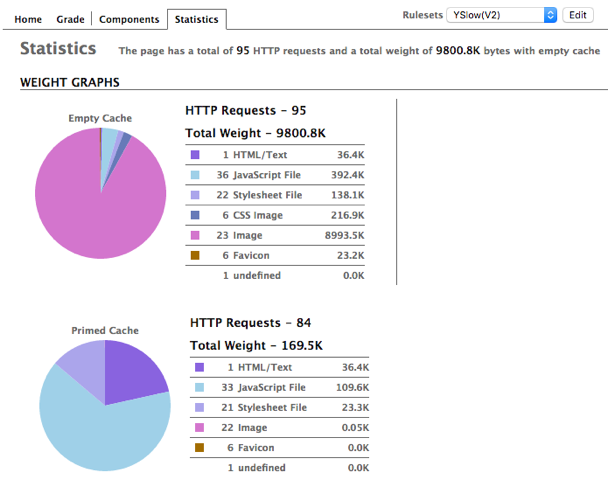

One of my favourite projects was for my friend Shira, for her award-winning food & lifestyle site [In Pursuit of More](http://inpursuitofmore.com/). I had the opportunity to overhaul it and give it a fresh look (designed by Alexa Lupul), with an improved speed and experience. Check it out for awesome vegetarian recipes and overall inspiration for minimalism and simplicity.

## Initial purpose: make it faster

Shira was initially in need of a solution to the slow speed her site was suffering from. It took _ages_ to load, even on fast internet connections. In order to find the right solution, I performed an audit of her site in order to determine what her main issues were. To get an initial baseline, I took a look at Google's Pagespeed Insights tool to see what the situation was:

As you can see, we definitely had some issues here. Thankfully, tools like this can reveal a lot of what is going on, though not necessarily why - that would be completely dependent on the configuration settings of everything from your web server, to your content management system or framework, or your front-end code.

I kept digging. [YSlow](http://yslow.org/) was able to tell me the breakdown of the spread of assets being pulled into a given page:

Right away, I got a good indication of the major source of the speed problem. Look at the number of http requests, sky-high at 95!  And even with a cached page, there were _still 84 requests_.  This is completely bonkers, and overkill for just about any website, nevermind for one as straightforward and streamlined as this one.

For a typical web page, you might have a handful of requests - the first one will be to fetch the page itself, and then subsequent requests for whatever assets you might need, such as CSS or JavaScrit files, fonts, and images. We're talking maybe a dozen requests at this point, without any sort of optimization effort to lighten the load. The basic rule is that the more requests there are, the longer it takes to load the page.

In this case, it was a staggering number of CSS (36) and JS (22) files that were being requested, and a few more images than were needed. Never mind that the page weight was pushing 10 Mb, which was yet another problem. The source of the weight was fairly easy to determine on one of the blog post pages:

As you can see here, even these optimized Webp images weigh almost 2 Mb. Between the findings from Google's Page Speed Insights (and the details not shown above), YSlow, and a few other tools, I had the information I needed to go find out the root cause of the problems. Ultimately, it came down to these:

* _way_ too many http requests
* giant images
* (most likely) unneeded JS and CSS files

At this point, I needed access to the webserver and, in this case, the WordPress theme so that I could properly ascertain the source of all these extraneous http requests.

## Revised purpose: faster, with a new design

Ultimately what was needed was a complete rebuild of the WordPress theme. The exsting theme was a one-size-fits-all kind of theme, which does have its uses. For the novice site administrator, it has the potential to provide virtually limitless possibilities for assembling and customizing your website. Consequently, it unfortunately comes with boat-loads of extra features and plugins - all the bells and whistles - none of which were being used anywhere in this site. And yet, all of the code was being loaded anyway.

Thankfully, a new design in the works provided an excellent occasion for a new build for the site. Knowing the necessary features required to keep the site up to snuff, and armed with fresh designs, I went to work.

Since I had the opportunity to build a theme from the ground-up, I was able to get rid of virutally all of the extra plugins that added to the bloat of the site, and write the code to customize it to the new design.  Gone are the visual page builders and contact form plugins, as well as WP's own bloaty Jetpack. My new theme required a single plugin - Advanced Custom Fields (ACF), which enabled a customize authoring experience for the custom home page template, among other things.

I also managed to reverse-engineer a plugin that provided a short-code mechanism to achieve the side-by-side image motif which is featured throughout the site's posts. This functionality had to be preserved because these short codes are entered as a part of the post content (which persists in the database), and going through hundreds of posts to edit the short codes out was not a realistic thing to do. By adding (and customizing) this short-code as a part of the new theme, this feature continues to work for legacy content, as well as new content going forward.

Also gone was a mulitplicity of contact form plugins - I could write all of the front-end and back-end form handling myself.

Finally, for the image-heavy home page I was able to lazy-load all of the images that appear below the fold, as well as leverage the WordPress responsive image capabilities to get only the appropriate sizes for the given viewport. This is crucial for the sake of mobile devices - remember our 0/100 mobile score from Page Speed Insights above...

## Results: new design, faster site

In the end, in creating a brand new custom WordPress theme, I was able to reduce the 95 http requests down to just a few:
* 21 CSS files => just 1 minified file
* 33 JS files => just 1 minified file

I eliminated _all_ of the plugins (aside from ACF) and wrote all of the essential theme behaviours myself. Gone is the code bloat, and as a result we have a snappy site and a cleaned-up Admin experience that has only the essentials. The only additional plugins used are staples for any WP site - SEO, security, and caching.

There were a few server-side things that I unfortunately couldn't control, since the site lives on a large shared host where accessing such things isn't possible. Leveraging a CDN could have helped some of this, as well as improved asset delivery (not to mention provide SSL), but this was out of the scope of the project - perhaps a future improvement! In the end however, the transformation could not have been more radical, as you can see in our new results:

Scores over 85-90% are considered quite good - so landing at 94% is a fantastic grade, especially compared to the previous 28%, and 0% for mobile.

According to [Webpagetest](https://www.webpagetest.org), our new completed document size is a mere 330 KB and 7 requests (plus images), down from **almost 10 MB** and **95 requests**.  Mission accomplished!  The site loads incredibly fast, as the time to first interaction is 1.020s, and to complete at 3.2s on the image-heavy home page, down from over 17 seconds on the less image-heavy post page.

Thanks to Shira for enlisting my services to build her a blazing fast new site. This was a fun project with interesting challenges, and I couldn't be more pleased with the result.

